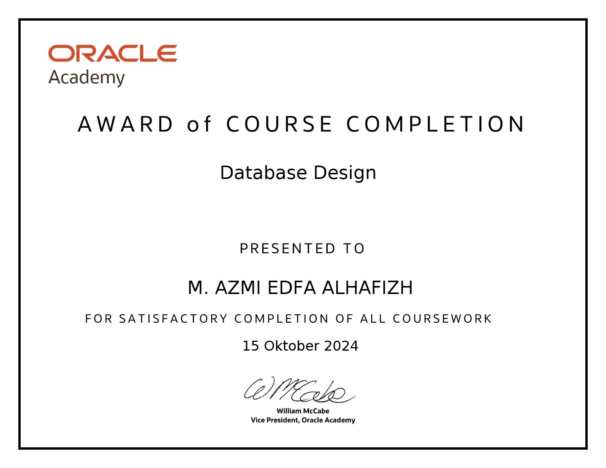

  

# 👋 Hallo, Selamat Datang!
## Saya M. Azmi Edfa Alhafizh

### 🎓 Mahasiswa Teknik Informatika - Universitas Lampung  
Saya seorang mahasiswa yang memiliki minat besar dalam dunia teknologi, khususnya di bidang:

- 💻 Pengembangan Perangkat Lunak  
- 🖥️ Administrasi Sistem Operasi  
- 🗄️ Manajemen Basis Data  
- 🌐 Pengelolaan Jaringan Komputer  

Saya aktif mengembangkan keterampilan melalui berbagai proyek, kompetisi, dan kegiatan organisasi. Saya juga senang belajar hal-hal baru dan terbuka untuk kolaborasi.

---

### 🚀 Keahlian
  
  
  
  
 
 

---
## 📄 Sertifikasi

Berikut beberapa sertifikasi yang telah saya peroleh:

<table>
  <tr>
    <td width="100px">
      
    </td>
    <td>
      <strong>MikroTik Certified Network Associate</strong> 
      <em>MikroTik, 2023</em>
    </td>
  </tr>
  <tr>
    <td>
      
    </td>
    <td>
      <strong>Sertifikat CLMS</strong> 
      <em>Oracle, 2024</em>
    </td>
  </tr>
  <tr>
    <td>
      
    </td>
    <td>
      <strong>Sertifikat Uji Kompetensi Keahlian</strong> 
      <em>SMKS Swadhipa 2 Natar, 2023</em>
    </td>
  </tr>
  <tr>
</table>

---

### 🏆 Pencapaian

- 🥇 **Juara 2** *Lomba Kejuruan Siswa* tingkat Provinsi Lampung  
- 🥇 **Juara Harapan 1** Lomba *IT Network System Administration* tingkat Provinsi Lampung
---
### 📫 Hubungi Saya
 
 

- Alternatif:
    📧 email: edfazmi@gmail.com
---

> _"Berproses hari ini untuk menjadi lebih baik dari kemarin."_  

<!--
**edfazmi/edfazmi** is a ✨ _special_ ✨ repository because its `README.md` (this file) appears on your GitHub profile.

Here are some ideas to get you started:

- 🔭 I’m currently working on ...
- 🌱 I’m currently learning ...
- 👯 I’m looking to collaborate on ...
- 🤔 I’m looking for help with ...
- 💬 Ask me about ...
- 📫 How to reach me: ...
- 😄 Pronouns: ...
- ⚡ Fun fact: ...
-->

